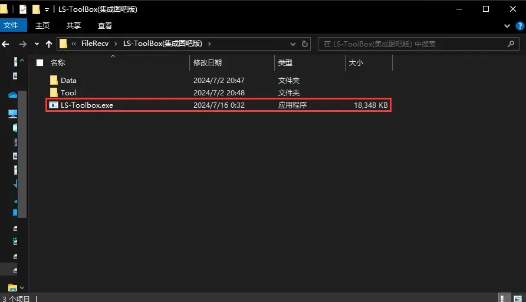
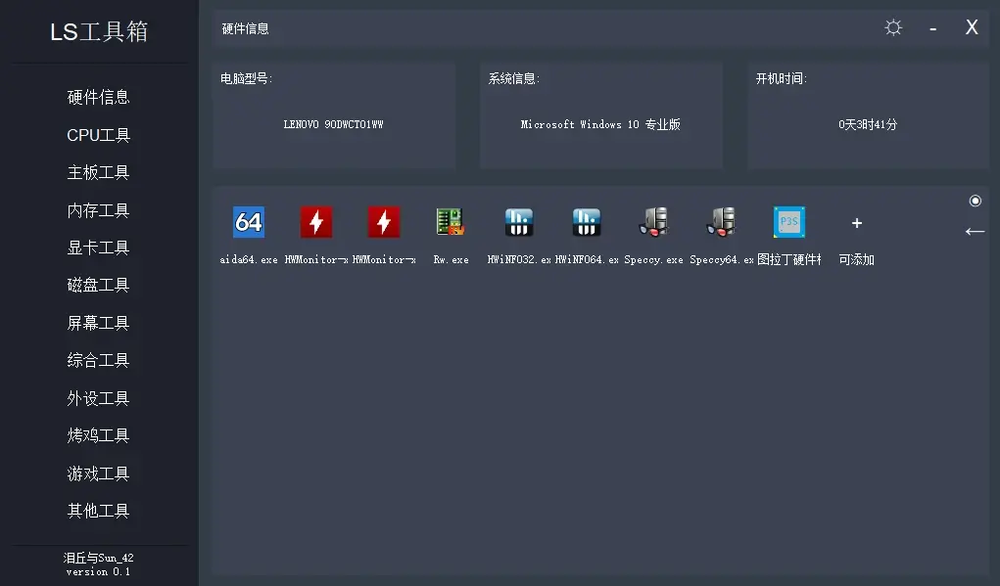
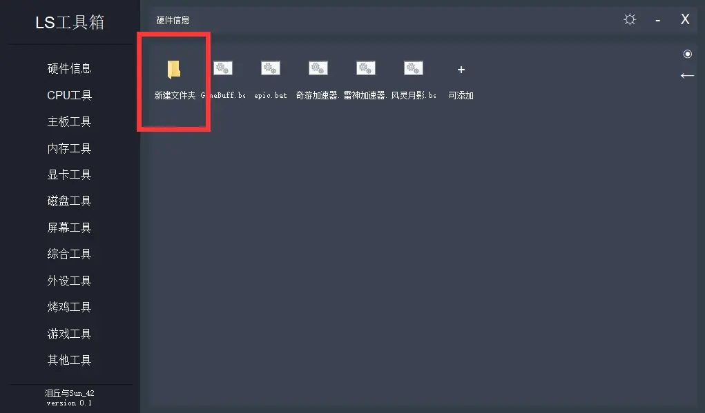

# LS工具箱_你的专属软件集成箱

#### 介绍
一款使用c++做的LS工具箱，不仅仅可以适用于硬件工具集成！
给创作者的一款工具箱软件
你们可以在此基础上自由创作

#### 使用说明
LS工具箱教学
打开程序

先找到软件exe并打开

打开后界面:

打开应用
1.点击左侧列表找到您需要的工具界面
2.双击应用图标即可!(部分软件可能打开较慢,几秒内没有反应,如果10s后还未打开,那就是您的配置较弱,或泪丘技术差等,请给泪丘一点时间)

自己集成
1.将要集成的整个软件文件夹复制到LS工具箱,可在工具箱的exe同级目录或LS工具箱文件夹内任意文件夹即可!(因为怕有依赖和文件管理原因,泪丘还在考虑是否要将这一步和第二部融合,自动复制到内)

2.点击加号,找到复制到LS工具箱的的软件的软件,可为exe、bat、lnk

(注意:lnk为本机的快捷方式,若在操作1中复制进来的文件为lnk或集成的exe、bat只是在LS工具箱文件夹一个磁盘内,但并不在LS工具箱文件夹内,都会出现无法压缩包后整个传输的情况,只适用于本机此软件不移动的情况使用此类操作!)

删除集成
1.将集成的整个软件文件夹删除

2.找到LS工具箱内Tool文件夹,里面的文件夹翻译后便为左侧列表默认文字时的中文

3.在其中找到文件名最后几个字为:你当时集成时的软件名字.软件后缀.Tool

4.将其删除即可!

(所以其实要是能看出来Tool文件的原理,你也可以出了短时间内无法解决的问题就手动制作.Tool文件)高级用法!
多级文件夹
示例如图: 

文件夹图标可双击打开,然后可在文件夹内集成软件,甚至可以文件夹内塞文件夹,可以一直套娃下去!有助于你更好的集成软件!

右侧有两个图标,圆形的图标为回到首页,箭头为返回上一级文件夹

设置
(注:别忘了点击保存喔,保存后关闭设置界面即可生效)

#### 参与贡献

1.泪丘 
[泪丘B站主页](https://space.bilibili.com/2065972905)
 2.Sun_42
 [Sun_42 B站主页](https://space.bilibili.com/1265301910)

#### 网盘链接
网盘链接：https://pan.baidu.com/s/11n07VtOEjLwSk7USMYFKtA?pwd=tool提取码：tool
 蓝奏云链接：https://www.ilanzou.com/s/t9VRbLr密码：colj

#### 官方测试群
QQ：967659082

#### 感谢大家的支持，我们会做出更好的软件开源的，为爱发电，完全免费。
